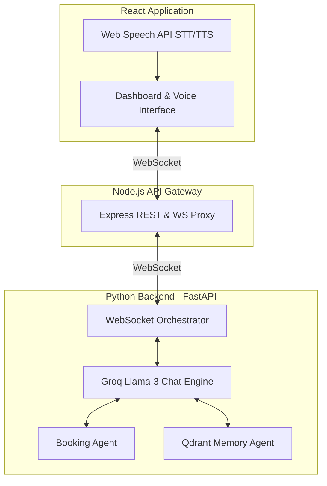

<div align="center">
  <h1>🏥 ClinicVoice AI</h1>
  <p><strong>Next-Generation Multilingual Voice Agent for Healthcare</strong></p>
  <p>
    <a href="https://github.com/Sreddy08840/VoiceCare-AI/stargazers"></a>
    <a href="https://github.com/Sreddy08840/VoiceCare-AI/issues"></a>
    
  </p>
  <p>
    
    
    
    
    
    
  </p>
</div>

---

## 🌟 Overview

**ClinicVoice AI** is a production-ready, ultra-low latency conversational voice AI agent designed specifically for medical clinics. Built with **Groq's Llama-3**, **FastAPI**, and **React**, it enables patients to autonomously book, reschedule, or cancel appointments through natural voice conversations. 

With deep memory retrieval powered by **Qdrant Cloud** and native **Multilingual Support** (English, Hindi, Tamil), ClinicVoice AI represents the bleeding edge of healthcare automation.

---

## ✨ Key Features

- ⚡ **Ultra-Low Latency Voice**: Real-time voice interaction via WebSocket streaming.
- 🌍 **Native Multilingual Engine**: Seamlessly understands and responds in **English**, **हिंदी (Hindi)**, and **தமிழ் (Tamil)** with automatic language detection and code-switching capabilities.
- 🧠 **Persistent Episodic Memory**: Leverages Qdrant Vector DB to securely recall past appointments, preferences, and patient history across sessions.
- 📅 **Intelligent Scheduling**: Fully automated booking, rescheduling, and cancellation with proactive conflict resolution.
- 🛡️ **Strict Scope Enforcement**: Politely but firmly redirects non-medical intents back to clinical scheduling.
- 🎨 **Modern Dashboard**: A beautiful React frontend providing live transcription, Web Speech API integration, and real-time appointment tracking.

---

## 🏗️ System Architecture

ClinicVoice AI operates on a robust three-tier architecture:



---

## 📁 Repository Structure

```tree
ClinicVoice-AI/
├── AGENTS.md               # Core System Prompts: Agent roles & language rules
├── SKILL.md                # Skill Workflows: Booking, Memory & Error Handling
├── start_servers.ps1       # 🚀 One-click startup script (Windows)
│
├── backend/                # Python AI Orchestrator
│   ├── main.py             # FastAPI WebSocket endpoint & agent wiring
│   ├── agents/             # Chat engine, Booking logic, Memory store (Qdrant)
│   └── requirements.txt    
│
├── api-gateway/            # Node.js API Gateway
│   └── index.js            # REST routes & WS Proxy
│
└── frontend/               # React + Vite + Tailwind UI
    └── src/App.tsx         # Main UI: Mic button, Live Transcription
```

---

## 🚀 Getting Started

### Prerequisites

| Tech | Version | Check Command |
|------|---------|---------------|
| **Python** | 3.10+ | `python --version` |
| **Node.js** | 18+ | `node -v` |
| **npm** | 8+ | `npm -v` |

### 1. Clone & Configure

```bash
git clone https://github.com/Sreddy08840/VoiceCare-AI.git
cd VoiceCare-AI
```

Create a `.env` file in the `backend/` directory:
```env
# Required — Groq LLM (Llama 3 70B)
GROQ_API_KEY=your_groq_api_key_here

# Required — Qdrant Cloud (Vector DB)
QDRANT_URL=https://your-cluster.cloud.qdrant.io
QDRANT_API_KEY=your_qdrant_api_key_here
```

### 2. Install Dependencies

```powershell
# Python Backend
cd backend && py -m pip install -r requirements.txt

# API Gateway
cd ../api-gateway && npm install

# Frontend
cd ../frontend && npm install
```

### 3. Launch the Platform

**Windows Users** can start everything with a single click:
```powershell
.\start_servers.ps1
```

*(This will spawn 3 terminal windows for the Backend, Gateway, and Frontend).*

**Manual Start:**
- Backend: `cd backend && py -m uvicorn main:app --reload --port 8000`
- Gateway: `cd api-gateway && node index.js`
- Frontend: `cd frontend && npm run dev`

---

## 🧪 Interactive Testing

1. Open **[http://localhost:5173](http://localhost:5173)** in your browser.
2. Click the **Blue Microphone Button** to initiate a session.
3. Use your microphone or the built-in testing simulators to interact:

| Test Scenario | Expected Agent Behavior |
|---------------|-------------------------|
| `"Book an appointment tomorrow"` | Asks clarifying questions (Doctor, Time, Dept) |
| `"Change my appointment to 5pm"` | Identifies existing slot, asks for confirmation before update |
| `"कल की अपॉइंटमेंट बुक कर दो"` | Seamlessly transitions and responds entirely in **Hindi** |
| `"Can you order me a pizza?"` | Politely declines & redirects to clinical context |

---

## ⚙️ Customizing Agent Behaviors

ClinicVoice AI is highly configurable through Markdown-based agent definitions. The system automatically reads these files to construct its LLM context.

- **`AGENTS.md`**: Define the core persona, tone, multilingual constraints, and strict domain scoping.
- **`SKILL.md`**: Map out complex workflows like the 8-step booking process, memory retrieval sequences, and conflict resolution logic.

*Simply edit these files, restart the backend, and the agent's behavior changes instantly!*

---

<div align="center">
  <p>Built with ❤️ by <a href="https://github.com/Sreddy08840">Sreddy08840</a></p>
  <p><b>Creator & Lead Developer</b> | Full-Stack · Voice AI · ML Integration</p>
</div>
